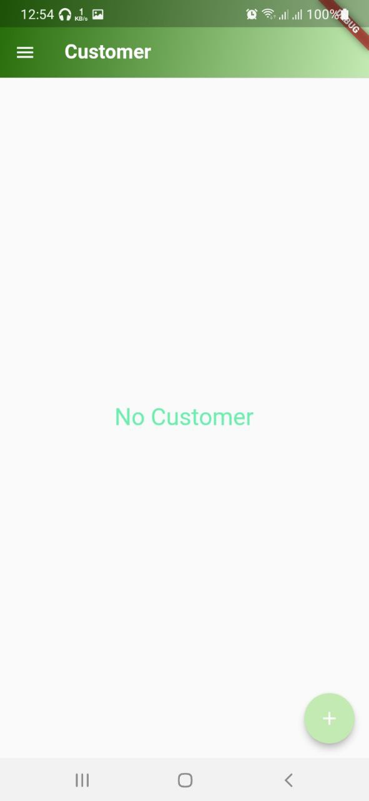

# Product_Receipt

In this project, I have implemented the Local DB so that user can save Customer, Item, Invoice and Expense details.

# Contents:

* SQfLite
* Navigation
* Firebase
* MVC
* Path Provider
* and many more...

# How to Install and Run the Project:

You can run this project:

1. Direct on Android Studio Emulator by this [link](https://github.com/RashadZA/product_receipt)
2. Physical Device. [Apk_link](https://drive.google.com/file/d/1-0oAlY-ahINbr5VLOkb_VICuDbSpT_ig/view?usp=sharing)

# How to Use the Project:

* Run this project on emulator or device.
* First you will see a login page.
* But first you need to crate an account for that you will find a crate button below the login button.
* Then you can login in the app.
* You will go to Home screen.
* There you will find app drawer.
* In drawer you will see a list Customer, Item, Invoice, Expense, Profile, Log Out.
* After clicking any of them you will see list of that then you can add and delete from the list except Profile and Log Out.
* Like if you click Customer You can see list of customers.
* Then you can delete or add customer from list of customers.
* If you click Profile you can see your details.
* If you click Log Out you will go back to the Log in screen.

## Sample Screenshots:

